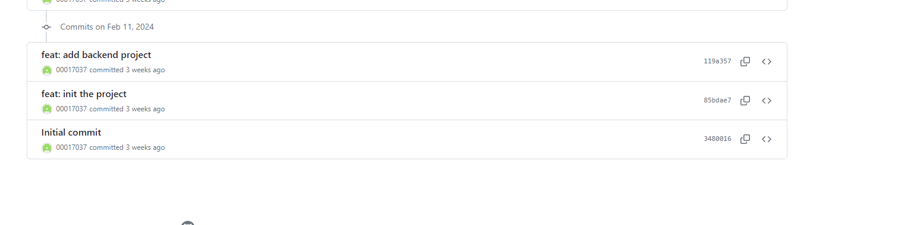
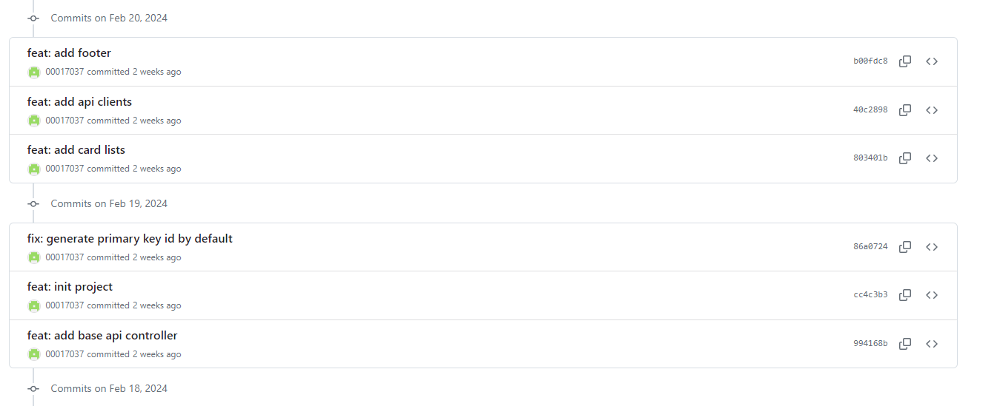
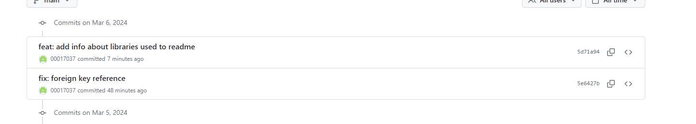

# This application was developed for Web Application module, as coursework portfolio project @ WIUT by student ID: 00017037

This project is developed as part of the coursework requirements. It implements an Issue Tracker system, designed to help users report and track issues within a project or organization.

## Student ID and Topic Selection

- Student ID: 00017037
- Selected Topic: Issue Tracker
- Calculation: `17037 % 20 = 17` (The remainder when dividing the student ID by 20 determines the topic, resulting in the selection of the Issue Tracker topic.)

### Front-end

- Angular Material: Utilized for designing a modern, responsive UI.

### Back-end

- Microsoft Entity Framework Core: Used for object-relational mapping to interact with the database.
- Entity Framework Core.Design, Microsoft.EntityFrameworkCore.SqlServer, and EntityFrameworkCore.Tools: These libraries support database schema migrations, design, and management.
- VisualStudio.Web.CodeGeneration.Design: Facilitates scaffolding of the application.
- Swashbuckle.AspNetCore: Implements Swagger for API documentation and testing.
  -ApsNetCore.MVC.NewtonsoftJson for serializing the json

## Github History Screenshots

- 

- 

- 
